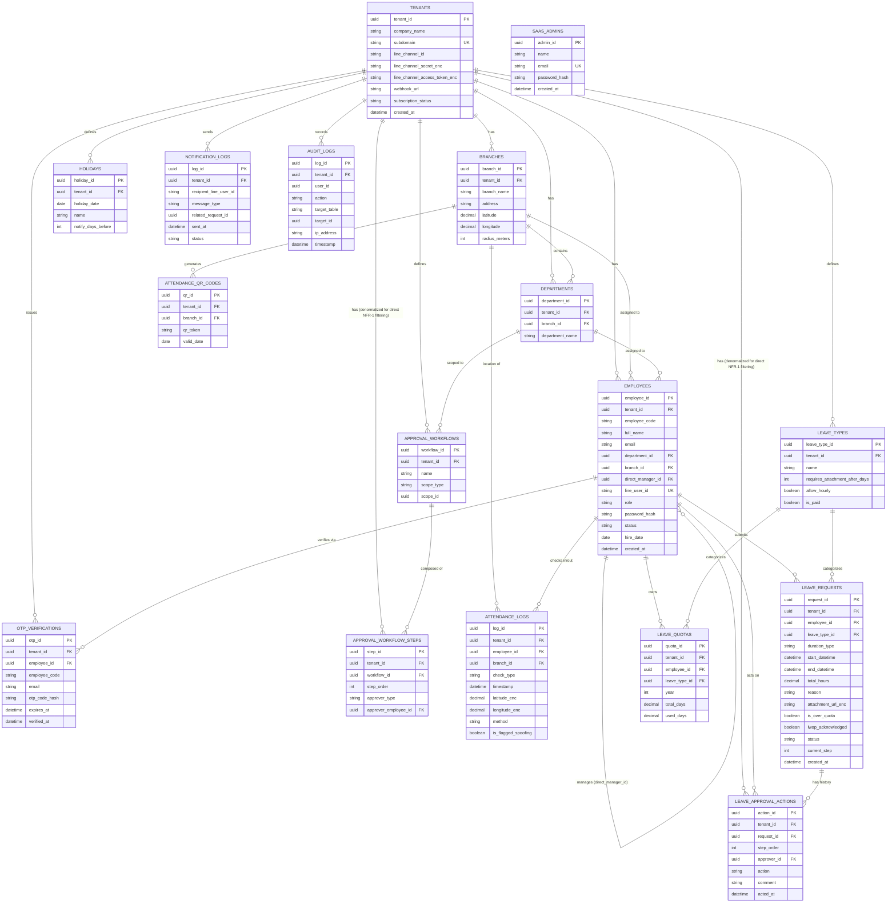

# 📑 Software Requirement Specification (SRS)

**Project Name:** LINE-Integrated Leave & Attendance Management System (Smart HR SaaS)  
**Version:** 1.4 (Official Baseline Specification - Updated)  
**Author:** Project Manager  
**Date:** July 2026  

---

## ประวัติการแก้ไขเอกสาร (Revision History)

| เวอร์ชัน | วันที่ | ผู้แก้ไข | รายละเอียดการเปลี่ยนแปลง |
|---|---|---|---|
| 1.0 | July 2026 | Project Manager | Baseline ฉบับแรก |
| 1.1 | 2026-07-12 | Project Manager | แก้ไขเลขหัวข้อ 3.x ให้ต่อเนื่อง, เพิ่ม FR-2.4 (ประวัติ/ยกเลิกการลา), FR-4.6 (จัดการโครงสร้างองค์กร), FR-4.7 (รายงานและ Export), NFR-6 (Performance/Availability), ออกแบบ Database ERD ในหัวข้อ 6 และปรับ NFR-6 ให้มีตัวเลข Capacity/SLA ที่ชัดเจน (100 Tenant, SLA 99.9%) ตามแผนธุรกิจจริง |
| 1.2 | 2026-07-12 | Project Manager | แก้ไขความกำกวม 8 จุดที่พบจาก QA test-plan (`qa/test-plans/pre-implementation-core-flows.md`): กฎคำนวณโควตารวม Pending (FR-2.2), เกณฑ์แนบเอกสารแบบสะสม 30 วัน (FR-2.2), ข้อจำกัดไฟล์แนบ (FR-2.2), การบังคับ Backend Validation ซ้ำสำหรับทุก Frontend Checkbox (FR-2.2, FR-3.2), การแสดงเหตุผลปฏิเสธให้พนักงาน (FR-2.4), การยุติ Workflow ทันทีเมื่อถูกปฏิเสธ (FR-3.2), ขยายขอบเขต Audit Log ให้ครอบคลุมการเปลี่ยนสายบังคับบัญชา/การปิดใช้งานพนักงาน (FR-4.6) และ Bulk Import (FR-4.2), และเพิ่มข้อกำหนด Atomic Write + Real Client IP ใน Audit Log (NFR-4) |
| 1.3 | 2026-07-12 | Project Manager | เพิ่ม FR-4.8 (Leave Type & Quota Policy Configuration) หลังพบระหว่างรีวิว Prototype ว่าเอกสารไม่เคยระบุว่า HR Admin กำหนดจำนวนวันลามาตรฐานต่อประเภทการลาที่ไหน — เดิมมีแค่การนำเข้าโควตาผ่าน Bulk Import (FR-4.2) แต่ไม่มีหน้าตั้งค่านโยบายกลางหรือการปรับโควตารายบุคคล |
| 1.4 | 2026-07-12 | Project Manager | เริ่ม Implementation จริง — พบระหว่างเขียน Prisma schema ว่า ERD ในหัวข้อ 6.1 ไม่ได้ใส่ `tenant_id` ให้ตาราง `approval_workflow_steps` และ `leave_approval_actions` (พึ่งพา Join ผ่านตารางแม่เท่านั้น) ซึ่งขัดกับเจตนาของ NFR-1 ที่ต้องการให้ทุกตารางระดับ Tenant กรองด้วย `tenant_id` ได้โดยตรง จึงเพิ่มคอลัมน์ `tenant_id` ให้ทั้งสองตารางเพื่อปิดช่องโหว่นี้ |

---

## 1. บทนำ (Introduction)

### 1.1 วัตถุประสงค์ (Purpose)
เอกสารฉบับนี้จัดทำขึ้นเพื่อกำหนดความต้องการทั้งเชิงฟังก์ชัน (Functional) และเชิงคุณภาพ (Non-Functional) ของระบบบริหารจัดการการลางานและลงเวลาเข้างานในรูปแบบ Multi-Tenant SaaS ที่เชื่อมต่อกับ LINE Official Account แบบแยกอิสระรายองค์กร เพื่อให้ทีมพัฒนา, ทีม UI/UX, และทีมประกันคุณภาพ (QA) ใช้เป็นแนวทางมาตรฐานเดียวกันในการพัฒนาซอฟต์แวร์

### 1.2 ขอบเขตของระบบ (Scope)
ระบบนี้เป็นแพลตฟอร์มซอฟต์แวร์สำเร็จรูป (SaaS) ในรูปแบบ **Cross-platform Web Application** ที่รองรับการทำงานแบบ **Responsive กับทุกอุปกรณ์** โดยผู้ใช้งานฝั่งองค์กร (พนักงานและหัวหน้า) จะดำเนินธุรกรรมทั้งหมดผ่าน **LINE Application (LINE OA + LIFF)** ทั้งการลางานและการสแกนเข้าทำงาน ในขณะที่ฝ่ายบุคคล (HR Admin) ของแต่ละองค์กรจะบริหารจัดการนโยบาย, สิทธิ์, ตั้งค่าวันหยุด และตรวจสอบเวลาเข้างานผ่าน **Web Admin Dashboard** โดยระบบจะทำการแยกขาดข้อมูล (Data Isolation) ของแต่ละองค์กรออกจากกันโดยสิ้นเชิง 100%

### 1.3 นิยามและคำย่อ (Definitions & Acronyms)
* **Tenant:** บริษัทหรือองค์กรที่สมัครใช้บริการระบบ
* **SaaS (Software as a Service):** การให้บริการซอฟต์แวร์ผ่านอินเทอร์เน็ตโดยคิดค่าบริการตามส่วนแบ่งการใช้งาน
* **LINE OA (LINE Official Account):** บัญชีไลน์ทางการของแต่ละบริษัท
* **LINE LIFF (LINE Front-end Framework):** เว็บแอปพลิเคชันที่เปิดทำงานอยู่ภายในห้องแชทของ LINE
* **LWOP (Leave Without Pay):** การลาโดยไม่ได้รับค่าจ้าง
* **Geofencing:** การกำหนดพื้นที่บนแผนที่จริงโดยใช้พิกัด GPS เพื่อจำกัดขอบเขตการทำงาน

---

## 2. ภาพรวมของระบบ (Overall Description)

### 2.1 มุมมองของระบบ (Product Perspective)
ระบบถูกออกแบบด้วยสถาปัตยกรรมคลาวด์แบบ Multi-Tenant โดยใช้ระบบฐานข้อมูลร่วมกัน (Shared Database) แต่ใช้ตรรกะการคัดกรองข้อมูลอย่างเข้มงวด (Logical Data Isolation) ร่วมกับการแยกสิทธิ์การรับส่งข้อความผ่าน LINE OA ของแต่ละองค์กรผ่าน Dynamic Webhook Gateway 

### 2.2 กลุ่มผู้ใช้งานระบบ (User Classes and Roles)
1. **SaaS Super Admin:** ผู้ดูแลระบบสูงสุด (เจ้าของแพลตฟอร์ม) มีสิทธิ์สร้าง/ระงับ บัญชีของแต่ละ Tenant และดูภาพรวมการใช้งาน
2. **Tenant Admin (HR Manager):** ฝ่ายบุคคลของบริษัทลูกค้า มีสิทธิ์จัดการพนักงาน นโยบายการลา สายอนุมัติ ตั้งค่าระบบเวลาเข้างาน และเข้าถึงรายงานของบริษัทตนเองเท่านั้น
3. **Approver (หัวหน้างาน):** ผู้มีสิทธิ์ตรวจสอบ พิจารณา อนุมัติหรือปฏิเสธคำขอลาของพนักงานในสายงาน และรับการแจ้งเตือนความเสี่ยงในการทำงานของพนักงานผ่าน LINE หรือ Web Browser
4. **Employee (พนักงาน):** พนักงานทั่วไป ยื่นคำขอลา, สแกนเวลาเข้า-ออกงาน และรับแจ้งเตือนสถานะต่างๆ ผ่าน LINE

---

## 3. ความต้องการเชิงฟังก์ชัน (Functional Requirements)

### 3.1 โมดูลการจัดการระบบผู้เช่า (SaaS Tenant & Global Management)
* **FR-1.1: Tenant Onboarding & Subdomain Routing**
  * ระบบต้องรองรับการสร้างบัญชีบริษัทใหม่ โดยระบบจะสร้าง URL แยกตามซับโดเมนย่อยอัตโนมัติ (เช่น `https://[subdomain].smarthr.io`)
* **FR-1.2: Dynamic LINE OA Config**
  * ระบบต้องมีช่องทางให้ Tenant Admin นำค่า `Channel ID`, `Channel Secret` และ `Channel Access Token` ของ LINE OA ประจำบริษัทมาตั้งค่าเองได้
  * ระบบหลังบ้านต้องสร้าง Dynamic Webhook Endpoint ในรูปแบบ `https://api.smarthr.io/v1/webhook/line/{tenant_id}` เพื่อคอยแยกแยะสัญญาณข้อมูลที่วิ่งมาจากไลน์ของแต่ละบริษัท

### 3.2 โมดูลฝั่งพนักงาน (Employee Role - LINE Interface)
* **FR-2.1: Secure Account Binding via OTP**
  * เมื่อพนักงานแอดไลน์เข้า LINE OA ของบริษัท ระบบต้องแสดง Rich Menu ปุ่ม "ลงทะเบียน" 
  * พนักงานเปิด LIFF กรอกรหัสพนักงานและอีเมลบริษัท ระบบจะส่งรหัส OTP 6 หลักเข้าอีเมลบริษัทเพื่อยืนยันตัวตน 
  * เมื่อกดยืนยัน ระบบจะบันทึก `line_user_id` ลงตารางและผูกเข้ากับ `tenant_id` ทันที ต่อจากนั้นระบบจะเปลี่ยน Rich Menu เป็นเมนูใช้งานปกติ
* **FR-2.2: Dynamic Leave Requesting**
  * ระบบ LIFF ต้องดึงโควตาและเงื่อนไขการลาที่ผูกกับ `tenant_id` ของพนักงานมาแสดงผล
  * พนักงานสามารถเลือกประเภทการลา และระบุช่วงเวลา (**เต็มวัน, ครึ่งวันเช้า, ครึ่งวันบ่าย, รายชั่วโมง**) โดยกรณีรายชั่วโมง ระบบต้องหักเวลาพักเที่ยงอัตโนมัติ
  * **Quota Calculation Rule (แก้ไขความกำกวม):** โควตาคงเหลือที่ใช้เปรียบเทียบเพื่อพิจารณาว่าเกินโควตาหรือไม่ ต้องคำนวณจาก `โควตาทั้งหมด - วันลาที่อนุมัติแล้ว - วันลาที่กำลังรออนุมัติ (Pending)` เสมอ เพื่อป้องกันพนักงานยื่นคำขอลาซ้อนกันหลายใบพร้อมกันจนเกินโควตาจริงโดยไม่มีการเตือนหรือบังคับ Checkbox แม้แต่ละใบเมื่อดูเดี่ยวๆ จะยังไม่เกิน ระบบต้องคำนวณ (Re-validate) ค่านี้ใหม่ที่ฝั่ง Backend ทุกครั้งที่มีการ Submit ไม่ใช้ค่าที่โหลดไว้ตอนเปิดฟอร์ม
  * **Frontend Checkbox Validation:** หากพนักงานเลือกวันลาที่คำนวณแล้วเกินโควตาคงเหลือ (ตามกฎด้านบน) ระบบต้องไม่บล็อกคำขอ แต่จะแสดงกล่องข้อความเตือนความปลอดภัย และบังคับให้พนักงานกดยอมรับเงื่อนไข (Checkbox) ว่า *"การลาครั้งนี้เกินโควตาและยินยอมให้ HR พิจารณาหักค่าจ้าง (LWOP)"* จึงจะกดส่งคำขอได้ **Backend ต้องตรวจสอบและบังคับเงื่อนไขนี้ซ้ำเสมอ** (ไม่เชื่อค่า `is_over_quota`/`lwop_acknowledged` ที่ส่งมาจาก Client ฝ่ายเดียว) เพื่อป้องกันการ Bypass ผ่านการเรียก API โดยตรง
  * **Conditional Attachment (แก้ไขความกำกวม — สะสมยอดลาป้องกันการหลบเลี่ยง):** เงื่อนไขบังคับแนบไฟล์ต้องพิจารณาจาก **ยอดสะสมของวันลาประเภทเดียวกันภายในรอบ 30 วันย้อนหลัง รวมกับจำนวนวันของคำขอที่กำลังยื่นนี้ด้วย** ไม่ใช่พิจารณาแค่จำนวนวันของคำขอเดี่ยวๆ หากยอดสะสม $\ge$ เงื่อนไขที่บริษัทตั้งไว้ (เช่น ลาป่วยสะสมตั้งแต่ 3 วันขึ้นไปในรอบ 30 วัน) หน้าจอ LIFF ต้องบังคับเปิดปุ่มอัปโหลดรูปภาพใบรับรองแพทย์ และไม่ยอมให้กดส่งหากไม่แนบไฟล์ ทั้งนี้เพื่อป้องกันพนักงานแบ่งคำขอลาป่วยเป็นหลายใบย่อยเพื่อหลบเลี่ยงเกณฑ์การแนบเอกสาร **Backend ต้องบังคับตรวจสอบเงื่อนไขนี้ซ้ำเช่นเดียวกับข้อข้างต้น**
  * **File Constraint (แก้ไขข้อที่ขาดหาย):** ไฟล์แนบใบรับรองแพทย์ต้องเป็นไฟล์ประเภท JPG, PNG หรือ PDF เท่านั้น ขนาดไฟล์ไม่เกิน 5 MB ต่อไฟล์ หากไฟล์ไม่ตรงเงื่อนไข ระบบต้องแสดงข้อความแจ้งเตือนและไม่ยอมให้อัปโหลด
* **FR-2.3: LINE Attendance Check-in (NEW)**
  * พนักงานสามารถบันทึกเวลาเข้า-ออกงาน ผ่านปุ่ม "ลงเวลาทำงาน" บน LINE Rich Menu ซึ่งจะเปิดหน้าจอ LINE LIFF Camera สำหรับสแกน QR Code ประจำจุดทำงาน หรือตรวจสอบพิกัด GPS (Geofencing) เทียบกับที่บริษัทกำหนด
  * ระบบต้องบันทึกวันเวลา (Timestamp) และพิกัดตำแหน่งจริงเข้าสู่ระบบของ Tenant นั้นๆ ทันที และแสดงข้อความยืนยันการเข้างานสำเร็จผ่าน LINE
* **FR-2.4: Leave History & Cancellation (NEW)**
  * พนักงานสามารถเรียกดูประวัติคำขอลาย้อนหลังทั้งหมดของตนเองผ่าน LIFF พร้อมสถานะปัจจุบัน (รออนุมัติ/อนุมัติแล้ว/ปฏิเสธ) และรายชื่อ/ขั้นตอนผู้อนุมัติที่กำลังพิจารณาอยู่
  * **Rejection Reason Visibility (แก้ไขความกำกวม):** เมื่อคำขอลาถูกปฏิเสธ ระบบต้องแสดงเหตุผลการปฏิเสธ (Comment Note ตาม FR-3.2) ให้พนักงานเจ้าของคำขอเห็นในหน้าประวัติด้วยเสมอ เพื่อให้พนักงานทราบเหตุผลและดำเนินการต่อได้ถูกต้อง
  * คำขอลาที่ยังมีสถานะ "รออนุมัติ" และยังไม่มีผู้อนุมัติคนใดกด Action เลย พนักงานสามารถกดยกเลิกคำขอได้ด้วยตนเอง หากมีการอนุมัติจากขั้นใดขั้นหนึ่งไปแล้ว ระบบต้องปิดสิทธิ์การยกเลิกเอง และแจ้งให้พนักงานติดต่อ HR แทน

### 3.3 โมดูลฝั่งผู้อนุมัติ (Approver Role - LINE & Web Interface)
* **FR-3.1: LINE Flex Message Routing**
  * เมื่อมีคำขอลาในระบบ ระบบต้องค้นหาหัวหน้างานในสายอนุมัติของบริษัทนั้นๆ และส่งการแจ้งเตือนรูปแบบ Flex Message ไปยัง LINE ส่วนตัวของผู้อนุมัติรายนั้นโดยตรง
* **FR-3.2: Multi-Stage Audit Trail Review**
  * เมื่อผู้อนุมัติกดปุ่ม [🔎 ตรวจสอบ] บน Flex Message ระบบจะเปิดหน้า LIFF Review
  * หน้าจอต้องแสดงข้อมูลประวัติ (Timeline): แสดงรายชื่อผู้อนุมัติในขั้นก่อนหน้า (ถ้ามี), วันเวลาที่ดำเนินการ, และข้อความบันทึก (Note) ของคนก่อนหน้าทั้งหมด
  * หากผู้อนุมัติกดปุ่ม [ปฏิเสธ] ระบบต้องกำหนดให้ฟิลด์ "เหตุผลการปฏิเสธ (Comment Note)" เป็นฟิลด์ที่จำเป็นต้องกรอก (Required) เสมอ และห้ามเป็นค่าว่างหรือช่องว่างล้วน (Whitespace-only) **Backend ต้องบังคับตรวจสอบเงื่อนไขนี้ซ้ำเสมอ** ไม่พึ่งพา Validation ฝั่ง Frontend เพียงอย่างเดียว
  * **Rejection Termination Rule (แก้ไขความกำกวม):** หากผู้อนุมัติในขั้นใดขั้นหนึ่ง (Step ใดก็ได้ของสายอนุมัติ) กดปฏิเสธ ระบบต้องเปลี่ยนสถานะคำขอลาทั้งใบเป็น "ปฏิเสธ" ทันที และยุติ Workflow ทั้งหมด **ไม่ส่งต่อไปยังผู้อนุมัติขั้นถัดไป** เพื่อไม่ให้คำขอที่ถูกปฏิเสธแล้วยังค้างอยู่ในสถานะรออนุมัติที่ขั้นอื่น
* **FR-3.3: Persistent Auto-Reminder**
  * ระบบหลังบ้านต้องตรวจสอบคำขอลาที่ค้างคาอยู่เป็นระยะ (ทุกๆ 24 ชั่วโมง) หากผู้อนุมัติยังไม่มี Action ระบบต้องส่ง Flex Message ไปทวงถามซ้ำๆ จนกว่าจะมีการกดอนุมัติหรือปฏิเสธ
* **FR-3.4: Proactive Leave Frequency Alert (NEW)**
  * ระบบหลังบ้านต้องมีอัลกอริทึมตรวจสอบความถี่การลาของพนักงานรายบุคคล หากพบว่าพนักงานมีประวัติการลาบ่อยครั้งจนผิดปกติ (เช่น ลารวมกัน > 5 วันภายในรอบ 30 วัน หรือลาในวันจันทร์/วันศุกร์ติดต่อกัน 3 สัปดาห์) 
  * ระบบต้องระบุสถานะ "High Absence Frequency Risk" ใน Flex Message ที่ส่งไปหาผู้อนุมัติ เพื่อเตือนให้หัวหน้าทราบล่วงหน้าและใช้ประกอบการตัดสินใจ (ใช้วางแผนงานทดแทน หรือกดปฏิเสธหากส่งผลกระทบต่อทีม)

### 3.4 โมดูลฝั่งฝ่ายบุคคล (Tenant Admin - Web Dashboard)
* **FR-4.1: Drag & Drop Approval Workflow Builder**
  * HR Admin สามารถสร้าง เปลี่ยนแปลง และกำหนดลูปสายการอนุมัติ (กี่ขั้นก็ได้) โดยใช้วิธีลากวางบล็อกตำแหน่ง แยกโฟลว์อิสระตามแผนก, สาขา หรือประเภทการลาได้
* **FR-4.2: Data Import & Management**
  * รองรับการนำเข้าข้อมูลพนักงานและโควตาวันลาเริ่มต้นผ่านการอัปโหลดไฟล์ Excel/CSV (Databulk Import)
  * **Bulk Import Audit Logging (แก้ไขข้อที่ขาดหาย):** หากการนำเข้าข้อมูลแบบ Bulk ส่งผลให้เกิดการเปลี่ยนแปลงข้อมูลพนักงานที่มีอยู่เดิมในระบบ (เช่น เปลี่ยน Role, สายบังคับบัญชา, สถานะการทำงาน, โควตาวันลา) ระบบต้องบันทึก Audit Log แยกเป็นรายการต่อการเปลี่ยนแปลงแต่ละรายการ (Per-record) ตามเงื่อนไขเดียวกับ FR-4.6 ห้ามบันทึกรวมเป็น Log ก้อนเดียวระดับไฟล์ (Batch-level only) เพราะจะทำให้ตรวจสอบย้อนหลังรายบุคคลไม่ได้ตาม NFR-4
* **FR-4.3: Company Holiday Calendar & Customizable Advanced Notification (NEW)**
  * HR สามารถกำหนดปฏิทินวันหยุดประจำปีของบริษัทได้บนเว็บคอนโซล
  * ระบบต้องเปิดให้ HR Admin สามารถกรอกจำนวนวันล่วงหน้าที่ต้องการให้แจ้งเตือนได้ด้วยตนเอง (เช่น 1 วัน, 3 วัน, หรือ 7 วัน) 
  * เมื่อถึงกำหนด (Scheduled Automation) ระบบหลังบ้านต้องประมวลผลส่งการ์ดแจ้งเตือนวันหยุด (Flex Message) ไปยัง LINE ของพนักงานทุกคนในบริษัทนั้นโดยอัตโนมัติ
* **FR-4.4: Real-Time HR Alert via LINE & Web**
  * ทันทีที่เคสพนักงานลาเกินโควตา (Over-quota) ได้รับการอนุมัติจากหัวหน้าครบถ้วนแล้ว ระบบต้องยิง Flex Message แจ้งเตือนตรงไปยัง LINE ของกลุ่ม HR ทันที และติดธงสีแดง (Flagged) บนรายงานระบบเว็บเพื่อเตรียมตัดเงินเดือนตอนสิ้นเดือน
* **FR-4.5: Attendance Location & Rule Setting (NEW)**
  * HR สามารถกำหนดพิกัดละติจูด/ลองจิจูด (Latitude/Longitude) และระยะรัศมีที่อนุญาต (Radius เช่น 50 เมตร) ของแต่ละสาขา หรือเจนเนอเรต Dynamic QR Code ประจำวัน สำหรับให้พนักงานใช้สแกนเข้างานผ่าน LINE ได้
* **FR-4.6: Organization Structure & Employee Management (NEW)**
  * นอกเหนือจากการนำเข้าข้อมูลเป็นชุด (FR-4.2) HR Admin ต้องสามารถสร้าง แก้ไข และปิดใช้งาน (Deactivate) ข้อมูลสาขา แผนก และพนักงานเป็นรายบุคคลผ่านหน้าเว็บได้โดยตรง
  * HR Admin สามารถกำหนด/เปลี่ยนสายบังคับบัญชา (Direct Manager) และปรับสิทธิ์บทบาท (Role: Employee/Approver/Tenant Admin) ของพนักงานแต่ละคนได้
  * **Audit Log Scope (แก้ไขความกำกวม — ขยายขอบเขต):** การเปลี่ยนแปลงต่อไปนี้ทุกครั้งต้องถูกบันทึกลง Audit Log ตาม NFR-4 โดยไม่มีข้อยกเว้น: (1) การเปลี่ยนสิทธิ์บทบาท (Role), (2) การเปลี่ยนสายบังคับบัญชา (Direct Manager), และ (3) การปิดใช้งาน/เปิดใช้งานพนักงาน (Activate/Deactivate) — การแก้ไขข้อมูลที่ไม่กระทบสิทธิ์หรือสถานะ (เช่น แก้เบอร์โทร, อีเมล) ไม่บังคับต้องบันทึก Audit Log แต่บันทึกเพิ่มได้ตามดุลยพินิจของทีมพัฒนา
  * การบันทึกแบบ No-op (บันทึกฟอร์มโดยไม่มีค่าใดเปลี่ยนแปลงจริง) ต้องไม่สร้างรายการ Audit Log ปลอม — ระบบต้องเปรียบเทียบค่าก่อน/หลังจริงก่อนตัดสินใจบันทึก
* **FR-4.7: Reporting & Data Export (NEW)**
  * ระบบต้องมีหน้ารายงานสรุปข้อมูลการลาและการเข้างาน (รายบุคคล/รายแผนก/รายบริษัท) พร้อมตัวกรองช่วงวันที่ ประเภทการลา และสถานะ
  * HR Admin ต้องสามารถ Export รายงานออกเป็นไฟล์ Excel (.xlsx) และ PDF ได้จากหน้าเว็บ (ตามปุ่ม Export ที่ระบุใน FR-5.1) และการ Export แต่ละครั้งต้องถูกบันทึกลง Audit Log ตาม NFR-4
* **FR-4.8: Leave Type & Quota Policy Configuration (NEW)**
  * HR Admin ต้องสามารถสร้าง แก้ไข และปิดใช้งานประเภทการลา (Leave Type) ของบริษัทได้เองผ่านหน้าเว็บ โดยกำหนด: ชื่อประเภทการลา, **โควตามาตรฐานต่อปี (Default Annual Quota)**, เงื่อนไขจำนวนวันสะสมที่บังคับแนบเอกสาร (ตาม FR-2.2) และว่าอนุญาตให้ลาแบบรายชั่วโมงหรือไม่
  * ค่าโควตามาตรฐานที่ตั้งไว้ในหน้านี้ต้องถูกใช้เป็นค่าเริ่มต้นเมื่อเพิ่มพนักงานใหม่ (FR-4.6) หรือนำเข้าพนักงานผ่าน Bulk Import (FR-4.2) หากไฟล์นำเข้าไม่ได้ระบุค่าเฉพาะเจาะจงมาด้วย การแก้ไขค่ามาตรฐานภายหลังต้องไม่ย้อนเปลี่ยนโควตาของพนักงานที่มีอยู่แล้วโดยอัตโนมัติ (ป้องกันปัญหาความเป็นธรรมและข้อพิพาทด้านสิทธิประโยชน์)
  * HR Admin ต้องสามารถปรับโควตาลาเป็นรายบุคคล (Override) ให้แตกต่างจากค่ามาตรฐานได้เป็นกรณีไป (เช่น พนักงานทดลองงานได้โควตาลาพักร้อนน้อยกว่าปกติ) การปรับโควตารายบุคคลทุกครั้งต้องถูกบันทึกลง Audit Log ตาม NFR-4 เช่นเดียวกับการเปลี่ยนแปลงสิทธิ์อื่นใน FR-4.6
  * หากมีการลบประเภทการลาที่มีคำขอลาอ้างอิงอยู่แล้วในระบบ ระบบต้องปฏิเสธการลบและแจ้งเตือน HR Admin แทน เพื่อป้องกันข้อมูลอ้างอิงเสียหาย (Referential Integrity)

---

## 4. ความต้องการด้านการแสดงผลและอุปกรณ์ (Cross-platform & Responsive Requirements)

* **FR-5.1: Multi-Device Responsive Layout**
  * ระบบหน้าเว็บทั้งหมด (Web Admin และ LINE LIFF) ต้องถูกออกแบบด้วยระบบ Fluid Grid System (เช่น Tailwind CSS) เพื่อรองรับการแสดงผลบนอุปกรณ์ที่ต่างกันอย่างไร้รอยต่อ โดยแบ่งสเปกตาม Breakpoints ดังนี้:
    1. **Mobile Screen (< 768px):** ออกแบบเป็น Single-column layout, เมนูหลักฝั่ง Web Admin จะซ่อนอยู่ใน Hamburger Menu ส่วนปุ่มกดฝั่ง LIFF (แบบฟอร์มลา และ ปุ่มสแกนเข้างาน) จะขยายเต็มความกว้างและยึดติดขอบล่าง (Bottom Sticky) เพื่อให้ง่ายต่อการกดด้วยนิ้วโป้ง
    2. **Tablet Screen (768px - 1024px):** หน้าจอรายงาน Data Table ขนาดใหญ่ฝั่ง HR จะต้องถูกจัดรูปแบบใหม่ให้อยู่ในรูปของ **Card Layout** อัตโนมัติ เพื่อให้สามารถใช้นิ้วปัด (Swipe) ดูข้อมูลเวลาเข้างานและใบลาได้ และแถบเมนูด้านซ้ายจะหดเหลือเฉพาะไอคอน (Icon-only sidebar)
    3. **Desktop Screen (> 1024px):** หน้าเว็บของ HR Dashboard จะแสดงผลข้อมูลแบบ Multi-column ได้เต็มพิกัด, ตารางรายงานแสดงผลครบทุกคอลหัมน์พร้อมปุ่ม Export, และหน้าจอสร้างโฟลว์อนุมัติ (Workflow Builder) จะเปิดใช้งานระบบ **Drag & Drop** ได้สมบูรณ์แบบ
* **FR-5.2: Touch & Gesture Optimization**
  * ระบบหน้าเว็บในส่วนที่เป็น Drag & Drop Flow Builder และหน้าปฏิทินวันหยุด ต้องรองรับทั้งพฤติกรรมการใช้เมาส์คลิก (Desktop) และการใช้ระบบสัมผัส (Touch Gestures: Tap, Drag, Swipe) บนอุปกรณ์ Tablet และ Smartphone อย่างลื่นไหล ไม่กระตุก

---

## 5. ความต้องการเชิงคุณภาพและความปลอดภัยขั้นสูง (Non-Functional & Security Requirements)

* **NFR-1: Strict Data Isolation (Global Query Filtering)**
  * ในระดับซอร์สโค้ดหลังบ้าน (Backend Database Driver) ต้องใช้ระบบ Global Context Interceptor เพื่อบังคับต่อท้ายคำสั่ง SQL ทุกชนิดด้วย `WHERE tenant_id = :current_tenant_id` โดยอัตโนมัติ เพื่อขจัดโอกาสที่โปรแกรมเมอร์จะเขียนโค้ดพลาดจนเกิดข้อมูลรั่วไหลระหว่างบริษัท (Cross-Tenant Data Leakage)
* **NFR-2: Data Encryption (At Rest & In Transit)**
  * ข้อมูลที่จัดเก็บในฐานข้อมูลที่จัดว่าเป็นข้อมูลส่วนบุคคล (เช่น รหัสผ่าน, ลิงก์รูปภาพใบรับรองแพทย์, พิกัด GPS การเข้างาน) ต้องถูกเข้ารหัสด้วยอัลกอริทึม AES-256 เสมอ
  * การเชื่อมต่อสื่อสารทั้งหมดระหว่าง LINE Platform, ลูกค้า, แอดมิน และระบบเซิร์ฟเวอร์หลังบ้าน ต้องผ่านโปรโตคอล HTTPS (TLS 1.3) เท่านั้น
* **NFR-3: LINE Access Token & Device Spoofing Verification**
  * ทุกครั้งที่ระบบ LINE LIFF มีการติดต่อสื่อสารมายังระบบ API หลังบ้าน หลังบ้านต้องทำการตรวจสอบ Token กับ LINE API Server ทุกครั้งเพื่อยืนยันตัวตน และสำหรับโมดูลเข้างาน (Attendance) ต้องมีการตรวจสอบระบบป้องกันการปลอมแปลงตำแหน่ง (Anti-GPS Spoofing) เพื่อความโปร่งใส
* **NFR-4: Security Audit Logs**
  * ระบบต้องมีระบบบันทึกประวัติอิสระ (Immutable Audit Logs) ที่ฝั่ง HR ไม่สามารถลบหรือแก้ไขได้ โดยจะบันทึกทุกครั้งที่มีการเข้าถึงข้อมูลรายงาน, การแก้ไขสิทธิ์พนักงาน, หรือการปรับเปลี่ยนโควตาวันลา (เก็บข้อมูล: User ID, Action, Timestamp, IP Address)
  * **Atomicity (แก้ไขความกำกวม):** การเขียนข้อมูลลง Audit Log ต้องอยู่ภายใน Database Transaction เดียวกันกับการดำเนินการที่ถูกบันทึก (Atomic Write) เสมอ หากการบันทึก Audit Log ล้มเหลวไม่ว่าด้วยเหตุใด ระบบต้อง Rollback การเปลี่ยนแปลงข้อมูลหลัก (เช่น การเปลี่ยน Role พนักงาน) ทั้งหมดด้วย เพื่อป้องกันกรณีที่มีการเปลี่ยนแปลงข้อมูลสำคัญเกิดขึ้นจริงแต่ไม่มีหลักฐานการตรวจสอบย้อนหลัง
  * `ip_address` ที่บันทึกต้องเป็น IP จริงของผู้ใช้งานปลายทาง (Original Client IP) ไม่ใช่ IP ของ Reverse Proxy/Load Balancer — หากระบบอยู่หลัง Proxy ต้องอ่านค่าจาก Header ที่เชื่อถือได้ (เช่น `X-Forwarded-For` ที่ผ่านการตรวจสอบแล้วว่ามาจาก Proxy ที่ระบบควบคุมเองเท่านั้น)
* **NFR-5: Cross-Browser Compatibility**
  * ระบบหน้าเว็บทั้งหมดต้องได้รับการทดสอบ (QA Testing) บนบราวเซอร์หลักอย่างน้อย 3 ตัว ได้แก่ Google Chrome, Apple Safari (สำหรับผู้ใช้ iOS/Mac) และ Microsoft Edge โดยต้องแสดงผลและทำงานได้ถูกต้อง 100%
* **NFR-6: Performance, Availability & Scalability (NEW)**
  * **Capacity Target:** ระบบต้องรองรับ Tenant พร้อมกันได้ไม่น้อยกว่า 100 บริษัท โดยแต่ละบริษัทมีพนักงานเฉลี่ย 50-200 คน (รวมพนักงานในระบบสูงสุดโดยประมาณ 20,000 คน)
  * **Peak Load Handling:** เนื่องจากการสแกนเข้า-ออกงาน (FR-2.3) ของหลาย Tenant มักกระจุกตัวในช่วงเวลาเดียวกัน (08:00-09:00 น. และ 17:00-18:00 น.) ระบบต้องรองรับ Concurrent Request ในช่วง Peak Window ได้ไม่น้อยกว่า 2,000 Requests พร้อมกันทั้งแพลตฟอร์ม โดยไม่เกิด Timeout หรือข้อมูลตกหล่น
  * **Response Time:** ทุก Request ที่ผ่านการคัดกรอง `tenant_id` (NFR-1) ต้องตอบสนองภายใน 2 วินาทีที่ P95 (95% ของ Request) และไม่เกิน 5 วินาทีที่ P99
  * **Uptime SLA:** ระบบต้องมี Uptime ไม่ต่ำกว่า 99.9% ต่อเดือน (Downtime สะสมได้ไม่เกิน ~43 นาที/เดือน) ยกเว้นช่วง Maintenance Window ที่แจ้งล่วงหน้าอย่างน้อย 24 ชั่วโมง โดยเฉพาะช่วง Peak Window ต้องหลีกเลี่ยงการ Maintenance โดยเด็ดขาด เนื่องจากกระทบการบันทึกเวลาเข้างานจริงของพนักงาน
  * **Scalability:** ระบบต้องรองรับการขยายตัวแบบ Horizontal Scaling (เช่น เพิ่ม Instance ของ Webhook Gateway/API Server) เมื่อจำนวน Tenant เกิน 100 บริษัท หรือปริมาณ Traffic เพิ่มขึ้น โดยไม่กระทบต่อ Downtime ของ Tenant ที่ใช้งานอยู่เดิม

---

## 6. โครงสร้างฐานข้อมูลระดับผู้เช่า (SaaS Database ERD Reference)

โครงสร้างความสัมพันธ์ (Relationships) ของแต่ละตารางจะผูกโยงโดยอ้างอิง `tenant_id` เป็นแกนหลัก ตามหลักการ Shared Database + Logical Data Isolation ที่ระบุใน NFR-1 กล่าวคือทุกตารางระดับ Tenant (ยกเว้นตาราง Platform-level อย่าง `tenants` และ `saas_admins`) จะมีคอลัมน์ `tenant_id` เป็น Foreign Key บังคับเสมอ และถูกกรองอัตโนมัติผ่าน Global Context Interceptor

### 6.1 แผนภาพความสัมพันธ์ (Entity Relationship Diagram)

### 6.2 คำอธิบายตารางหลักและการอ้างอิง FR

| ตาราง | ระดับ | คำอธิบาย | อ้างอิง FR/NFR |
|---|---|---|---|
| `tenants` | Platform | ข้อมูลบริษัทลูกค้าและการตั้งค่า LINE OA ต่อบริษัท | FR-1.1, FR-1.2 |
| `saas_admins` | Platform | บัญชีผู้ดูแลระบบสูงสุดของแพลตฟอร์ม (ไม่ผูก tenant_id) | 2.2 (Super Admin) |
| `branches` | Tenant | สาขาและพิกัด/รัศมี Geofencing ของแต่ละสาขา | FR-4.5 |
| `departments` | Tenant | แผนกในองค์กร ใช้เป็น Scope ของ Workflow Builder | FR-4.1, FR-4.6 |
| `employees` | Tenant | ข้อมูลพนักงานทุก Role (Employee/Approver/Tenant Admin), ผูก `line_user_id` และสายบังคับบัญชา (`direct_manager_id`) | FR-2.1, FR-4.6 |
| `otp_verifications` | Tenant | บันทึกรหัส OTP สำหรับการผูกบัญชี LINE | FR-2.1 |
| `leave_types` | Tenant | ประเภทการลาและเงื่อนไขแนบเอกสาร | FR-2.2 |
| `leave_quotas` | Tenant | โควตาวันลาคงเหลือต่อพนักงานต่อปี | FR-2.2 |
| `leave_requests` | Tenant | คำขอลาแต่ละรายการ รวมสถานะเกินโควตา/LWOP | FR-2.2, FR-2.4, FR-4.4 |
| `approval_workflows` / `approval_workflow_steps` | Tenant | โครงสร้างสายอนุมัติแบบ Drag & Drop หลายขั้น แยกตาม Scope | FR-4.1 |
| `leave_approval_actions` | Tenant | ประวัติการอนุมัติ/ปฏิเสธแต่ละขั้น (Audit Trail) | FR-3.2 |
| `attendance_qr_codes` | Tenant | QR Code รายวันต่อสาขาสำหรับสแกนเข้างาน | FR-2.3, FR-4.5 |
| `attendance_logs` | Tenant | บันทึกเวลาเข้า-ออกงานพร้อมพิกัดและวิธีการยืนยัน | FR-2.3, NFR-3 |
| `holidays` | Tenant | ปฏิทินวันหยุดและจำนวนวันแจ้งเตือนล่วงหน้า | FR-4.3 |
| `notification_logs` | Tenant | ประวัติการส่ง Flex Message ทุกประเภท | FR-3.1, FR-3.3, FR-4.3, FR-4.4 |
| `audit_logs` | Tenant/Platform | Immutable Log สำหรับการเข้าถึง/แก้ไขข้อมูลสำคัญ (Insert-only, ห้าม Update/Delete) | NFR-4 |

**หมายเหตุด้านความปลอดภัย:** คอลัมน์ที่มีคำต่อท้าย `_enc` (เช่น `line_channel_secret_enc`, `attachment_url_enc`, `latitude_enc`/`longitude_enc`) ต้องถูกเข้ารหัสด้วย AES-256 ตาม NFR-2 ก่อนบันทึกลงฐานข้อมูล และตาราง `audit_logs` ต้องกำหนดสิทธิ์ระดับ Database ห้าม Role ของแอปพลิเคชันฝั่ง HR ทำการ `UPDATE`/`DELETE` โดยเด็ดขาดตาม NFR-4